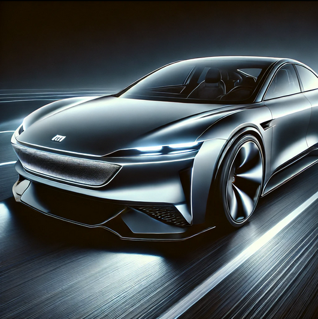

# Xiaomi SU7 Landing Page

 <!-- Zamenite sa pravom putanjom do slike -->

Ovo je moderna i responzivna landing page za Xiaomi SU7, električni automobil koji kombinuje inovaciju, performanse i elegantan dizajn. Sajt je dizajniran da prikaže ključne karakteristike i specifikacije vozila, uz interaktivnu galeriju i kontakt formu.

---

## 📌 Sadržaj

- [O Projektu](#-o-projektu)
- [Tehnologije](#-tehnologije)
- [Kako Pokrenuti Projekat](#-kako-pokrenuti-projekat)


---

## 🚀 O Projektu

Ovaj projekat je landing page za Xiaomi SU7, napravljen koristeći moderne web tehnologije. Sajt uključuje:
- **Interaktivnu galeriju** sa automatski pomerajućim slikama.
- **Kontakt formu** za slanje poruka.
- **Responzivni dizajn** koji radi na svim uređajima.

Cilj projekta je da predstavi Xiaomi SU7 na vizuelno privlačan i funkcionalan način, pružajući korisnicima sve potrebne informacije na jednom mestu.

---

## 🛠 Tehnologije

Projekat je izrađen koristeći sledeće tehnologije:

- **HTML5** - Za strukturu sajta.
- **CSS3** - Za stilizovanje i animacije.
- **JavaScript** - Za interaktivne funkcionalnosti.
- **PHP** - Za obradu kontakt forme.

---

## 🖥 Kako Pokrenuti Projekat

### Lokalno Pokretanje

1. **Klonirajte repozitorijum:**
   ```bash
   git clone https://github.com/aleksandarm03/SU7-landing-page.git


2. Otvorite projekat:

    Otvorite index.html u vašem browseru.
